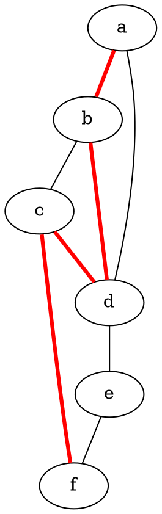

# DOT Language

- https://graphviz.org/doc/info/lang.html

---

```sh
dot test.dot  -Kcirco -Tpng -o test.png
```


```graphviz
graph {
    // node[shape=circle];
    a -- b[color=red,penwidth=3.0];
    b -- c;
    c -- d[color=red,penwidth=3.0];
    d -- e;
    e -- f;
    a -- d;
    b -- d[color=red,penwidth=3.0];
    c -- f[color=red,penwidth=3.0];
}
```