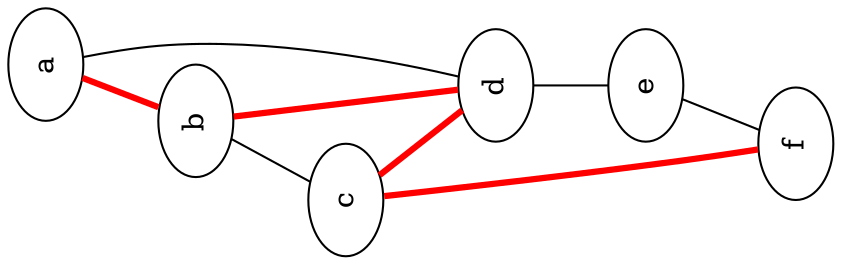

# GraphX

- DSA: https://github.com/cggos/DSA

---

## GraphViz with Dot

```graphviz
graph {
    orientation=landscape

    // node[shape=circle];
    a -- b[color=red,penwidth=3.0];
    b -- c;
    c -- d[color=red,penwidth=3.0];
    d -- e;
    e -- f;
    a -- d;
    b -- d[color=red,penwidth=3.0];
    c -- f[color=red,penwidth=3.0];
}
```

## Image Matching Graph

- https://pypi.org/project/libccv/

  

