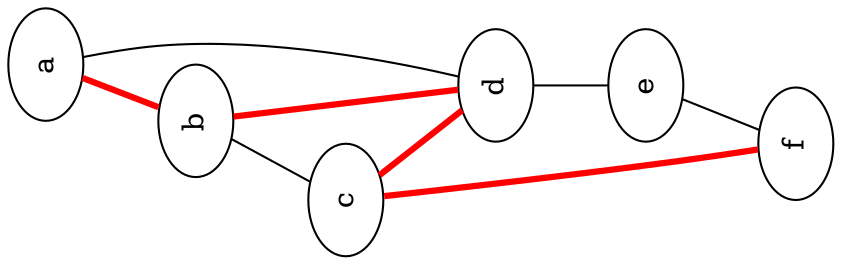

# GraphX

**Graph Anything**

GraphX is a research and experimentation repository dedicated to graph theory, data visualization, and graphical algorithms. It serves as a centralized hub for exploring various graph engines and visualization tools.

---

## 🚀 Key Technologies

- **Graph Engines**: [igraph](https://igraph.org/) (Python & R), [GraphViz](https://graphviz.org/) (DOT)
- **Visualization**: [cairocffi](https://pypi.org/project/cairocffi/), [Inkscape](https://inkscape.org/) (SVG)
- **Documentation**: [MkDocs Material](https://squidfunk.github.io/mkdocs-material/)
- **Languages**: Python, R, DOT, Markdown

---

## 📁 Project Structure

- `docs/`: Project documentation and guides.
- `igraph/`: Implementations using the igraph library in Python and R.
- `GraphViz/`: Examples and templates for the DOT language.
- `Inkscape/`: SVG design templates.
- `python/`: Custom graph data structure implementations and experiments.

---

## 🛠️ Quick Start

### Documentation
View the local documentation site:
```bash
pip install mkdocs-material
mkdocs serve
```

### Python Experiments
Install dependencies and run a sample script:
```bash
pip install python-igraph cairocffi
python igraph/python/ig00.py
```

---

## 📊 Examples

### GraphViz with Dot



### Image Matching Graph

- Based on [libccv](https://pypi.org/project/libccv/)

<p align="center">
  
</p>

---

## 🔗 Related Projects

- [DSA (Data Structures and Algorithms)](https://github.com/cggos/DSA)
