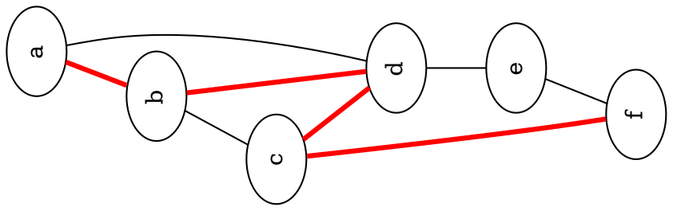

# GraphX

**Graph Anything**

GraphX is a research and experimentation repository for graph theory, data visualization, and graphical algorithms. It covers graph engines, visualization tools, and foundational data structures across multiple languages.

---

## Key Technologies

| Area | Tools |
|---|---|
| Graph Engines | [igraph](https://igraph.org/) (Python & R), [GraphViz](https://graphviz.org/) (DOT) |
| Visualization | [cairocffi](https://pypi.org/project/cairocffi/), [Inkscape](https://inkscape.org/) (SVG) |
| Data Structures | C++11 (linked lists, trees, algorithms) |
| Documentation | [MkDocs Material](https://squidfunk.github.io/mkdocs-material/) |
| Languages | Python, R, C++, DOT |

---

## Structure

| Directory | Contents |
|---|---|
| `igraph/` | Python & R scripts using the igraph library |
| `GraphViz/dot/` | DOT language graph definitions |
| `python/` | Pure Python graph data structure experiments |
| `tree/` | C++ binary tree implementations |
| `dsa/` | C++ linked lists, algorithms, unit tests |
| `Inkscape/` | SVG design templates |
| `docs/` | MkDocs source files |

---

## Quick Start

### Documentation
```bash
pip install mkdocs-material pymdown-extensions
mkdocs serve
```

### Python (igraph)
```bash
pip install python-igraph cairocffi
python igraph/python/ig00.py
```

### GraphViz
```bash
dot -Tpng GraphViz/dot/test.dot -o test.png
```

### C++ (DSA)
```bash
cd dsa && mkdir -p build && cd build
cmake .. && make
```

---

## Examples

### GraphViz with Dot



### Image Matching Graph

Based on [libccv](https://pypi.org/project/libccv/)

<p align="center">
  
</p>
